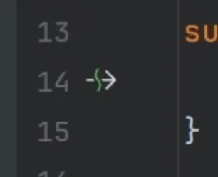

# Suspending Functions

## Key Takeaways

- _suspending_ a function just means pausing a function.
- Kind of already stated previously; but ultimately, this function is what causes a function to suspend: `suspendCoroutineUninterceptedOrReturn()`.
- Coroutine builders spin up a new coroutine and queue its suspending lambda to run.

## Code Snippets & Gotchas

This arrow means something on the line is calling a suspending function.



---

Simplified implementation of `suspendCoroutine`:
```kotlin
public suspend inline fun <T> suspendCoroutine(crossinline block: (Continuation<T>) -> Unit): T {
    // 1. The primitive function is called here!
    return suspendCoroutineUninterceptedOrReturn { uCont ->
        
        // 2. Intercept the continuation (ensure it runs on the correct thread/Dispatcher)
        val interceptable = uCont.intercepted()
        
        // 3. Create a safe wrapper around it
        val safe = SafeContinuation(interceptable)
        
        // 4. Execute your code block where you, for example, start a network request
        block(safe)
        
        // 5. SafeContinuation checks: Did the developer call .resume() synchronously/immediately?
        // If not, the magic value "COROUTINE_SUSPENDED" is returned here!
        safe.getOrThrow() 
    }
}
```

