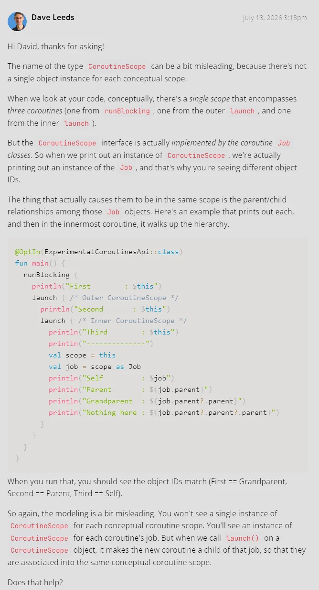

# Ways to Get a Scope

## Key Takeaways

- `GlobalScope` is the least recommended way to get a scope (memory leaks, etc.), but it sure is convenient.
- Some frameworks have their scopes - for example `viewModelScope` in Android, which is tied to the lifecycle.

## General Notes

When you see red squiggling lines due to missing scope, and you are in doubt, you can wrap the function in a `coroutineScope` wrapper. It will give it whatever scope the caller is using. It's kind of considered the gold standard.

## Code Snippets & Gotchas

Dave claims that _"When nesting one coroutine builder within the lambda of another, the coroutines will be scoped together naturally."_, but it doesn't seem to be true based on this little experiment:
```kotlin
fun main() = runBlocking<Unit> {
    launch { // Outer CoroutineScope
        println("Outer Scope: $this")

        launch { // Inner CoroutineScope
            println("Inner Scope: $this")
        }
    }
}

// Outer Scope: StandaloneCoroutine{Active}@574caa3f
// Inner Scope: StandaloneCoroutine{Active}@27abe2cd
```

According to my understanding, the output should show the same object twice. I've posted a question to Dave - awaiting a reply and will post it here.

***Update:*** Dave responded with a very detailed response, which made sense:

_(sorry about the quality, I'm compressing all the screenshots into_ `webp` _here)_



I ran his code example and got this:
```
First        : BlockingCoroutine{Active}@161cd475 // Grandparent
Second       : StandaloneCoroutine{Active}@64cee07 // Parent
Third        : StandaloneCoroutine{Active}@5f5a92bb // Self
--------------
Self         : StandaloneCoroutine{Active}@5f5a92bb
Parent       : StandaloneCoroutine{Completing}@64cee07
Grandparent  : BlockingCoroutine{Completing}@161cd475
Nothing here : null
```

