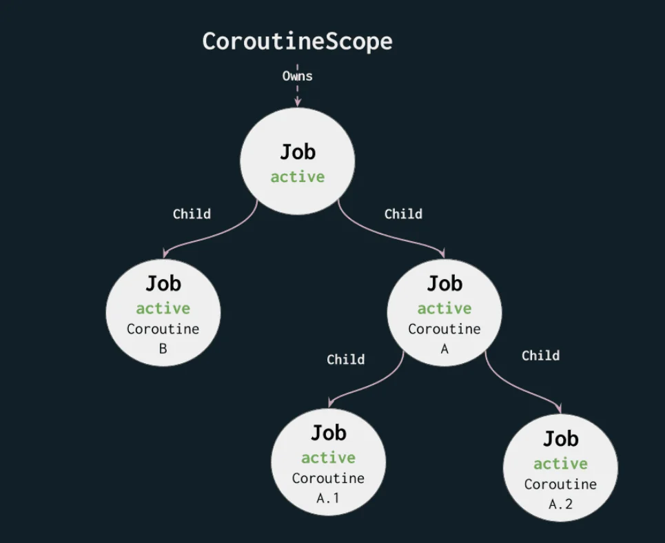

# Scopes and Suspending Functions

## Key Takeaways

- When you use `suspend main()` instead of `main()`, Kotlin actually "secretly" wraps it in a root coroutine that runs on main thread! _(see gotchas below)_
- `coroutineScope` isn't considered a coroutine builder, but a scope builder.
- You can think of `coroutineScope` as a suspending version of `runBlocking`.

## General Notes

This lesson made me reflect - why _does_ a coroutine need a scope?
While Kotlin could have been designed to let us spawn background tasks freely without one (like traditional threads), language creators intentionally enforced `CoroutineScope` to fix a huge historical problem. Back in the day, with regular threads, it was easy to run jobs on them and then accidentally forget about them, so they would run even after the user closed the screen, leading to memory leaks.

Scopes were created to prevent this. When a scope is cancelled (like when a screen closes), it automatically cancels and cleans up all active jobs inside it.



## Code Snippets & Gotchas

When you write:
```kotlin
suspend fun main() {
    // Your code
}
```

The Java Virtual Machine (JVM) cannot execute a suspend function directly, because it requires a standard, synchronous `public static void main(String[] args)` method to entry-point a program.

Therefore, under the hood, the Kotlin compiler secretly generates that standard main function for you and wraps your code inside a root coroutine using `runBlocking` (conceptually):

```kotlin
// What the compiler generates behind the scenes (simplified):
fun main(args: Array<String>) {
    runBlocking {
        `suspend main`() // Your code runs in here!
    }
}
```

