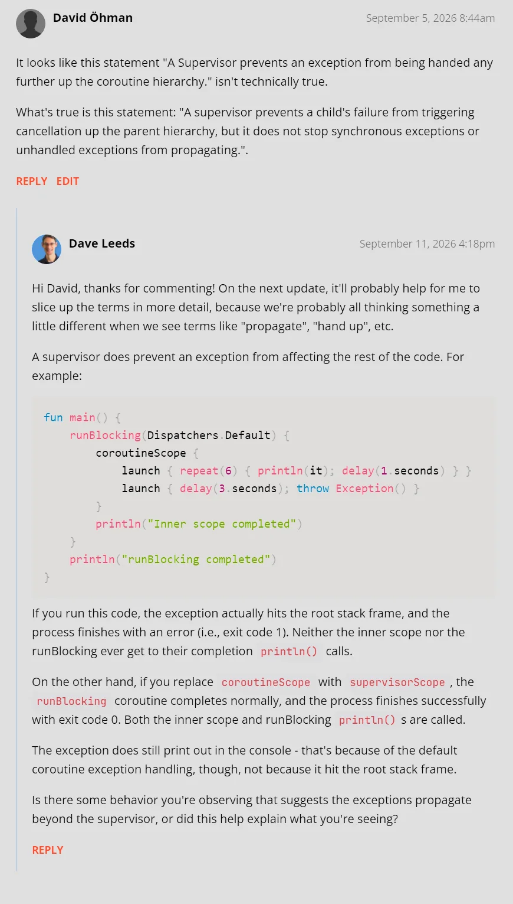

# Supervisors

## Key Takeaways

- A `supervisorScope` isolates cancellation failures among its direct child coroutines, but it does not catch synchronous exceptions thrown in its body, prevent uncaught exceptions from reaching the thread's handler, or isolate mutations to shared state.

## General Notes

Dave has this statement as a takeaway:

_"A Supervisor prevents an exception from being handed any further up the coroutine hierarchy."_

After digging in the code and talking to AI, this seems not to be true. What's true is this statement:

_"A supervisor prevents a child's failure from triggering cancellation up the parent hierarchy, but it does not stop synchronous exceptions or unhandled exceptions from propagating."_

I've posted this as a comment for the lesson. I will update here once he responds.

**Update:**

Hmm, I tested his code and it indeed doesn't crash the program when it should, according to the earlier statement, as I ran the code in `main`. I don't remember why I believed in that statement, but I will let this go. A Supervisor **does** stop the exception from being propagated, but it prints out the exception.

